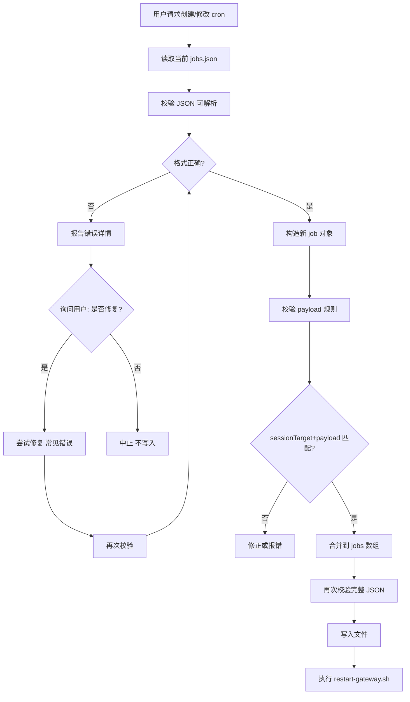

# Cron Jobs Writer — 安全写入 jobs.json

## 触发条件

以下任一情况触发本技能：

1. **创建/修改**：用户要求创建定时任务、修改 cron、添加提醒
2. **排查/检修**：用户反馈「定时任务看不到」「cron 不工作」「定时任务列表加载失败」，或 Gateway 日志出现 cron 相关错误（如 `Failed to parse cron store`）

写入或排查 `~/.openclaw/cron/jobs.json` 前必须按本技能流程执行，否则可能导致 Gateway 解析失败、KeepAlive 反复重启。

## 0. 路径与生效（必读）

**唯一正确路径**：`~/.openclaw/cron/jobs.json`

- **不要**读写 `workspace/cron/jobs.json` 或任何 `workspace/` 下的 cron 文件
- Gateway 只加载 `~/.openclaw/cron/jobs.json`，写错路径等于没修

**修改后必须重启**：修改 jobs.json 后，必须执行 `{{SKILL_DIR}}/scripts/restart-gateway.sh`（pkill 彻底结束 Gateway 后 start，避免双实例），cron 模块才会重新加载配置。否则修改不生效。

## 写入流程（必须遵守）



## 排查流程（cron 不工作 / 定时任务看不到时）

当用户反馈 cron 相关问题时，**不要**直接重启 Gateway。先执行：

```bash
bash {{SKILL_DIR}}/scripts/validate-jobs-json.sh ~/.openclaw/cron/jobs.json
```

- **若校验失败**：按「1. 写入前必须校验」中的流程：报告错误 → 询问是否修复 → 修复后再次校验
- **若校验通过**：jobs.json 格式正常，问题可能在其他（如 DeskClaw 客户端传 `all` 给 cron.list、Gateway 未启动等），可排查 Gateway 日志或建议用户重启

## 1. 写入前必须校验

在**任何**写入 `jobs.json` 的操作之前，先执行：

```bash
bash {{SKILL_DIR}}/scripts/validate-jobs-json.sh ~/.openclaw/cron/jobs.json
```

- **若校验失败**：
  1. 向用户报告错误详情（JSON 解析失败位置、payload 不匹配的 job 等）
  2. **询问用户**：「当前 jobs.json 存在格式问题，是否需要我帮你修复？」
  3. 若用户同意 → 尝试修复（见下方「修复校对」）→ 再次校验
  4. 若用户拒绝或无法修复 → 中止，不写入
- **若校验通过**：再构造新 job 并合并

## 1.1 修复校对（校验失败时）

当用户同意修复时，按以下优先级尝试：

| 错误类型 | 修复方式 |
|----------|----------|
| JSON 解析失败（如漏逗号） | 用 `json.load` + `json.dump` 重新序列化，或手动补逗号 |
| `sessionTarget: "isolated"` 但 `payload.kind: "message"` | 改为 `kind: "agentTurn"`，`text` 改为 `message` |
| `sessionTarget: "main"` 但 `payload.kind: "message"` | 改为 `kind: "systemEvent"`，保持 `text` |
| 缺必填字段 | 按 schema 补全或标记为需用户确认 |

修复后必须再次运行校验脚本，通过后再继续。**修复完成并校验通过后，执行 `{{SKILL_DIR}}/scripts/restart-gateway.sh`**，否则 cron 不会加载新配置。

## 2. payload 规则速查

| sessionTarget | payload.kind   | 提示内容字段 |
|---------------|----------------|--------------|
| `main`        | `systemEvent`  | `text`       |
| `isolated`    | `agentTurn`    | `message`    |

**常见错误**：
- `isolated` 用 `payload.kind: "message"` → 会报 `isolated job requires payload.kind=agentTurn`
- `agentTurn` 用 `text` 而非 `message` → 必须用 `message`

## 3. JSON 追加规则

向 `jobs` 数组追加新 job 时：

- **确保前一元素末尾有逗号**：`},` 后接 `{`，不能是 `}` 后直接 `{`
- 推荐：用 Python `json.load` + `json.dump` 读写，避免手写 JSON 漏逗号
- 写入后再次运行校验脚本确认，然后执行 `{{SKILL_DIR}}/scripts/restart-gateway.sh`

## 4. 禁止事项

- **不要**读写 `workspace/cron/jobs.json`，cron 配置只在 `~/.openclaw/cron/jobs.json`
- **不要**传 `all` 给 `cron.list`（Gateway 不支持该参数）
- **不要**让 `cron.runs` 的 `limit` 超过 200
- **不要**在 Gateway 运行时手动编辑 jobs.json（Gateway 会覆盖）

## 5. 参考

- 完整 schema、示例、isolated vs main 对照：`{{SKILL_DIR}}/references/schema.md`
- 官方文档：[OpenClaw Cron Jobs](https://docs.clawd.bot/automation/cron-jobs)
